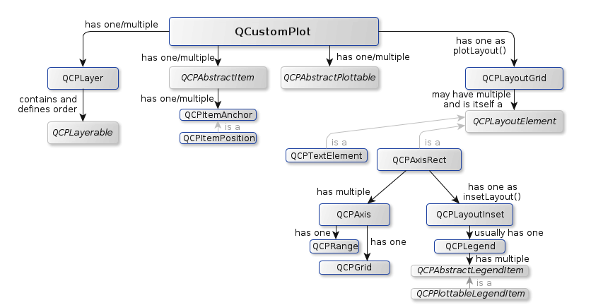

## QCustomplot 类图

学习一个库首先需要了解的就是这个库，由QCustomlot源码下的文档翻译而成。需要了解源码文档的伙伴可以下载源码打开该目录下的documentation/html/index.html,本人使用的是QCustomPlot 2.0.1版本。

### 类图分析

* QCustomPlot(图表):包含一个或者多个图层，一个或多个item，用于展示一些固定的元素，例如矩形，线段，文本等。这是QWidget，它显示绘图并与用户进行交互。

* QCPLayer(图层): 包含基本元素(QCPLayerable)

* QCPAbstractItem: 包含一个或者多个位置信息

* QCPAxisRect(坐标轴矩形): 包含多个坐标轴。

#### QCPLayerable

QCPLayerable元素是类图中最重要，用的最多的，几乎除了QCPLayer以外的元素都是继承于该类。

* QCPAbstractPlottable: 绘图元素，包含以下功能：QCPGraph(折线图)，(QCPCurve)曲线图,QCPBars(柱状图),QCPStatiBox(盒子图)，QCPColorMap(色谱图),QCPFinancial(金融图)

* QCPAbstractItem: 绘图中所有项的抽象基类， 包含:QCPItemBracket(在情节中引用/突出某些部分的方括号),QCPItemCurve(从一点到另一点的曲线),QCPItemEllipse(	椭圆形),QCPItemLine(从一点到另一点的线),QCPItemPixmap(任意像素图),QCPItemRect(矩形),QCPItemStraightLine(一条在两个方向上无限延伸的直线),QCPItemText(文字标签),QCPItemTracer(圆点)

* QCPLayoutElement(构成布局系统的所有对象的抽象基类),	QCPAbstractLegendItem(QCPLegend中所有条目的抽象基类),QCPAxisRect(容纳多个轴并将它们排列成矩形)

* QCPGrid(网格线)： 每一个坐标轴，上下左右四个坐标轴。

### 类的功能

| 类名 | 功能 |
| ---- | ---- |
| QCPAbstractPaintBuffer | 绘画缓冲区的抽象基类，用于定义渲染后端 |
| QCPPaintBufferGlFbo | 基于OpenGL框架的绘画缓冲区使用硬件加速渲染来缓冲对象 |
| QCPPaintBufferGlPbuffer | 使用硬件加速渲染的基于OpenGL像素缓冲区的绘画缓冲区 |
| QCPPaintBufferPixmap | 使用软件栅格渲染的基于QPixmap的绘制缓冲区 |
| QCPAxisTicker | QCPAxis用来创建刻度位置和刻度标签的基类刻度生成器 |
| QCPAxisTickerDateTime | 日历日期和时间的专用轴行情记录作为轴行情记录 |
| QCPAxisTickerFixed | 带有固定刻度线步的专用轴行情线 |
| QCPAxisTickerLog | 适用于对数轴的专用轴指示器 |
| QCPAxisTickerPi | 以任意常数(如pi)为单位显示刻度的专用轴时钟 |
| QCPAxisTickerText | 允许在指定的坐标处使用任意标签的专用轴计数器 |
| QCPAxisTickerTime | 专门的轴为时间跨度在毫秒到天的单位 |
| QCPBarsData | 保存QCPBars的单个数据点（一个条形）的数据 |
| QCPBarsGroup | 将多个QCPBar分组在一起，以便它们并排显示 |
| QCPColorGradient | 定义用于例如QCPColorMap的颜色渐变 |
| QCPColorMapData | 存放QCPColorMap绘图表的二维数据 |
| QCPCurveData | 为QCPCurve保留一个数据点的数据 |
| QCPDataContainer< DataType > | 一维绘图表的通用数据容器 |
| QCPDataRange | 描述由开始索引和结束索引给定的数据范围 |
| QCPDataSelection | 通过保存多个QCPDataRange实例来描述数据集 |
| QCPErrorBarsData | 保留QCPErrorBars的一个错误栏的数据 |
| QCPFinancialData | 保存QCPFinancial单个数据点的数据 |
| QCPGraphData | 保存QCPGraph的单个数据点的数据 |
| QCPItemAnchor | 可以附加位置的项目的锚点 |
| QCPItemPosition | 管理项的位置 |
| QCPLayer | 可能包含对象的图层，用于控制渲染顺序 |
| QCPLayerable | 所有可绘制对象的基类 |
| QCPAbstractItem | 绘图中所有项的抽象基类 |
| QCPItemBracket | 在情节中引用/突出某些部分的方括号 |
| QCPItemCurve | 从一点到另一点的曲线 |
| QCPItemEllipse | 一个椭圆 |
| QCPItemLine | 一条从一点到另一点的线(线段) |
| QCPItemPixmap | 一个任意象素映射 |
| QCPItemRect | 一个矩形 |
| QCPItemStraightLine | 在两个方向上无限延伸的直线 |
| QCPItemText | 一个文本标签 |
| QCPItemTracer | 一个项，圆点 |
| QCPAbstractPlottable | 表示图形中对象的所有数据的抽象基类 |
| QCPAbstractPlottable1D< DataType > | 一个用于一维数据的绘图的模板基类 |
| QCPAbstractPlottable1D< QCPBarsData > |  |
| QCPBars | 在标绘中表示条形图的标绘表 |
| QCPAbstractPlottable1D< QCPCurveData > |  |
| QCPCurve | 在绘图中表示参数曲线的可标绘表 |
| QCPAbstractPlottable1D< QCPFinancialData > |  |
| QCPFinancial | 表示金融股票图表的标绘表 |
| QCPAbstractPlottable1D< QCPGraphData > |  |
| QCPGraph | 表示标绘中的图形的可标绘表 |
| QCPAbstractPlottable1D< QCPStatisticalBoxData > |  |
| QCPStatisticalBox | 一种表示标绘中单个统计框的标绘表 |
| QCPColorMap | 表示绘图中二维颜色映射的标绘表 |
| QCPErrorBars | 一个标绘表，它向其他标绘表添加一组错误条 |
| QCPAxis | 管理QCustomPlot中的单个轴 |
| QCPGrid | 负责绘制QCPAxis的网格 |
| QCPLayoutElement | 构成布局系统的所有对象的抽象基类 |
| QCPAbstractLegendItem | 一个QCPLegend中所有条目的抽象基类 |
| QCPPlottableLegendItem | 图例项目，代表带有图标和绘图表名称的绘图表 |
| QCPAxisRect | 容纳多个轴并将它们排列成矩形 |
| QCPColorScale | 用于颜色编码数据（例如QCPColorMap）的色标 |
| QCPLayout | 布局的抽象基类 |
| QCPLayoutGrid | 在网格中排列子元素的布局 |
| QCPLegend | 在QCustomPlot中管理图例 |
| QCPLayoutInset | 将子元素与边界对齐或任意放置的布局 |
| QCPTextElement | 显示文本的布局元素 |
| QCPSelectionRect | 提供矩形/橡胶波段数据选择和范围变焦交互 |
| QCPLineEnding | 处理线条状物件的不同结尾装饰 |
| QCPMarginGroup | 如果使用多个布局元素，则边距组允许边距边的同步 |
| QCPPainter | 内部使用的QPainter子类 |
| QCPPlottableInterface1D | 为一维绘图表定义抽象接口 |
| QCPAbstractPlottable1D< DataType > | 具有一维数据的绘图表的模板基类 |
| QCPAbstractPlottable1D< QCPBarsData > |  |
| QCPAbstractPlottable1D< QCPCurveData > |  |
| QCPAbstractPlottable1D< QCPFinancialData > |  |
| QCPAbstractPlottable1D< QCPGraphData > |  |
| QCPAbstractPlottable1D< QCPStatisticalBoxData > |  |
| QCPErrorBars | 一个将一组误差线添加到其他绘图表的绘图表 |
| QCPRange | 表示轴所涵盖的范围 |
| QCPScatterStyle | 表示散点的视觉外观 |
| QCPSelectionDecorator | 控制如何绘制绘图表的数据选择 |
| QCPSelectionDecoratorBracket | 一个选择装饰器，在每个选定的数据段周围绘制括号 |
| QCPStatisticalBoxData | 为QCPStatisticalBox保留一个数据点的数据 |
| QCPVector2D | 将两个双精度数表示为数学2D向量 |
| QCustomPlot | 这是QWidget，它显示图形并与用户交互 |
