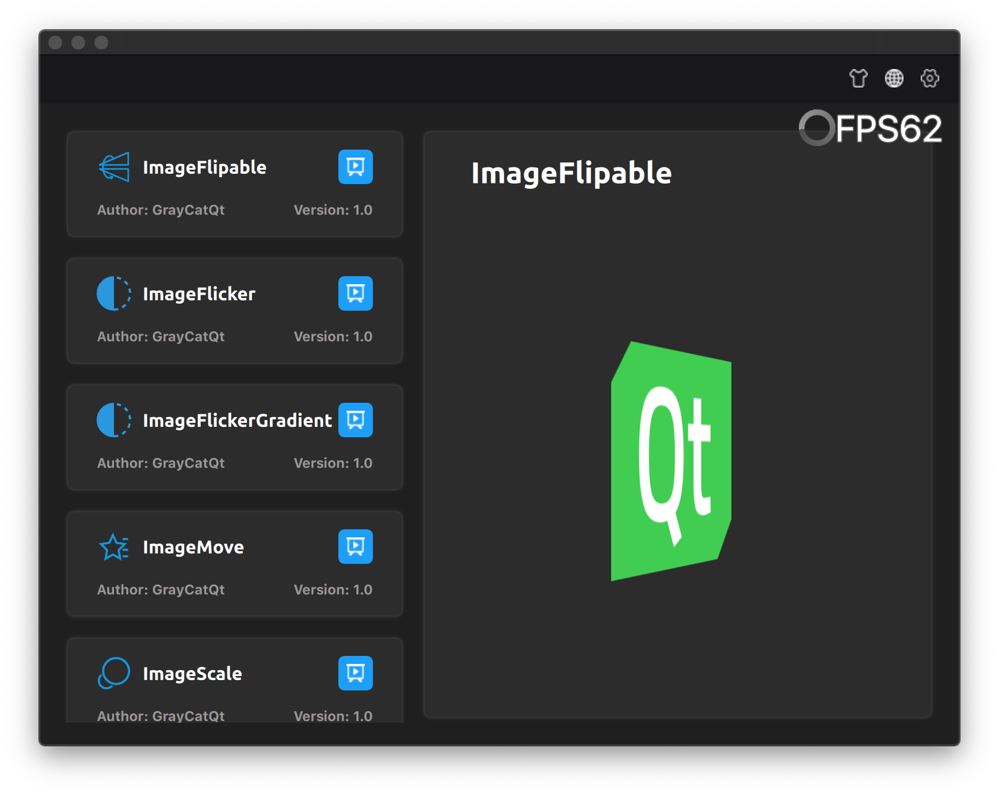
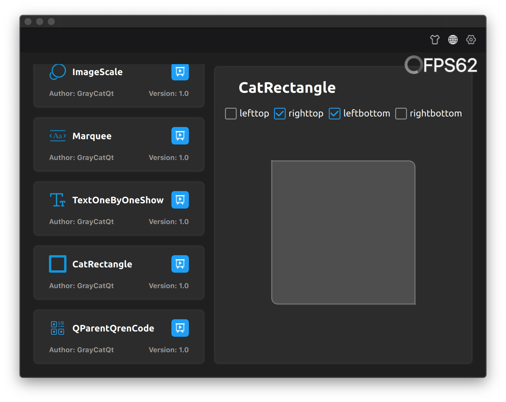
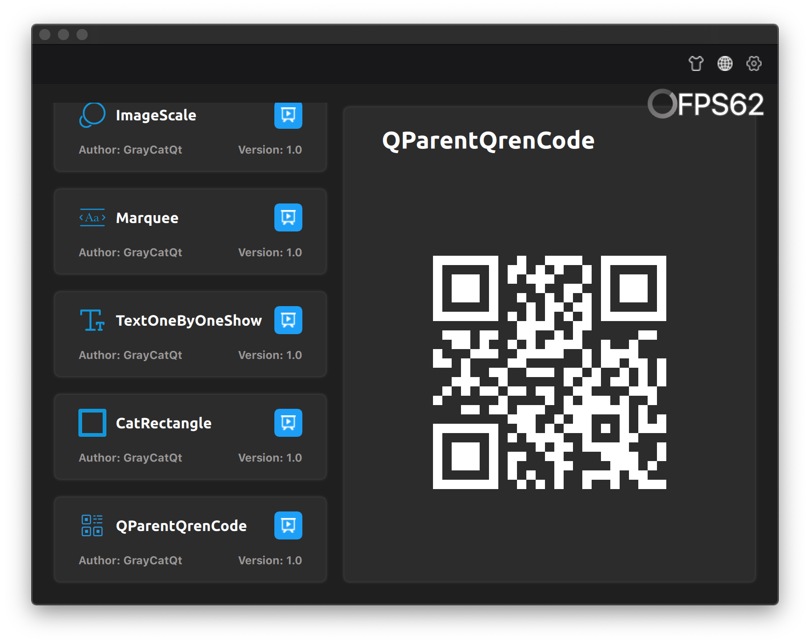
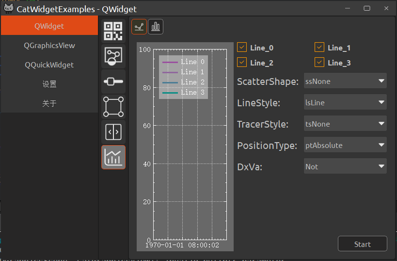
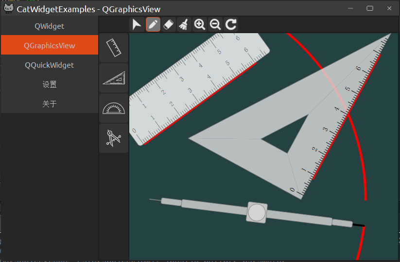
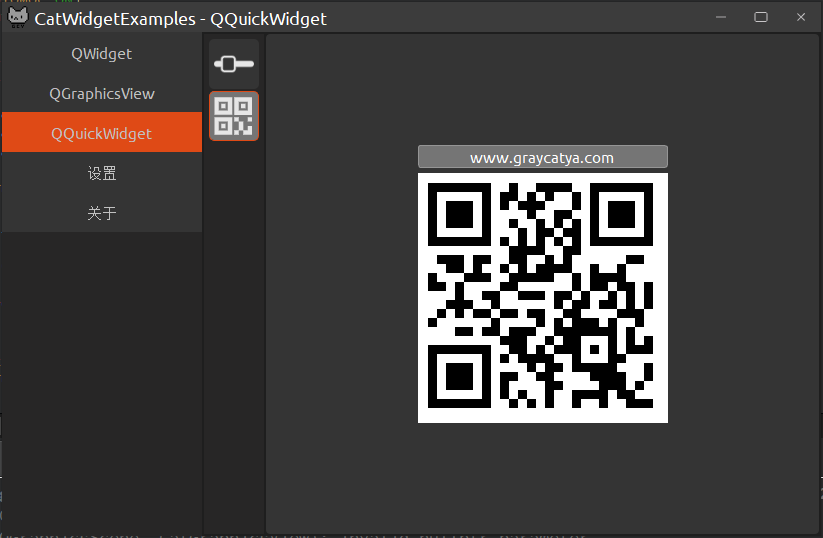
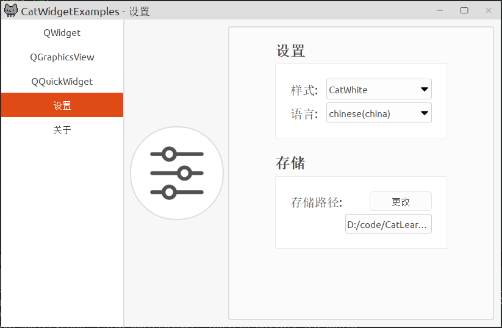

## 目录

- [目录](#目录)
- [CatLearnQt](#catlearnqt)
- [项目地址](#项目地址)
- [徽章预览](#徽章预览)
  - [项目](#项目)
  - [编译](#编译)
- [开发环境](#开发环境)
  - [项目根目录说明](#项目根目录说明)
  - [核心库](#核心库)
    - [使用核心库](#使用核心库)
      - [GrayCatQt](#graycatqt)
        - [qmake](#qmake)
        - [cmake](#cmake)
      - [GrayCatQtQuick](#graycatqtquick)
        - [qmake](#qmake-1)
        - [cmake](#cmake-1)
      - [GrayCatQtCore](#graycatqtcore)
        - [qmake](#qmake-2)
        - [cmake](#cmake-2)
  - [Examples 项目](#examples-项目)
    - [CatQuickExamples效果预览](#catquickexamples效果预览)
      - [控件列表](#控件列表)
      - [效果演示](#效果演示)
      - [Figma原型](#figma原型)
    - [CatWidgetExamples效果预览](#catwidgetexamples效果预览)
    - [MetroDemo惠州地铁案例效果预览](#metrodemo惠州地铁案例效果预览)
  - [赞助](#赞助)

## CatLearnQt

CatLearnQt 记录自己学习Qt过程.

CatLearnQt是根据GPL v3许可发行，如果您使用CatLearnQt或其组成库，则必须遵守相关许可条款。


## 项目地址

| 镜像仓库 | 地址 |
|:--:|:--:|
| ![GitHub] | [Github](https://github.com/graycatya/CatLearnQt) |
| ![Gitee] | [Gitee](https://gitee.com/graycatya/CatLearnQt) |
| ![CodeChina] | [CodeChina](https://codechina.csdn.net/qq_32312307/CatLearnQt) |

[GitHub]: ./doc/Images/github.svg
[Gitee]: ./doc/Images/gitee-fill-round.svg
[CodeChina]: ./doc/Images/codechina.png

## 徽章预览

### 项目

|[最佳实践计划][CII-link]|[许可][license-link]| [在线社区][Gitter-link] |
|:--:|:--:|:--:|
|![CII-badge]|![license-badge]|![Gitter]|

[CII-badge]: https://bestpractices.coreinfrastructure.org/projects/4578/badge
[CII-link]: https://bestpractices.coreinfrastructure.org/zh-CN/projects/4578

[license-link]: https://github.com/graycatya/CatLearnQt/blob/main/Licence.md "LICENSE"
[license-badge]: https://img.shields.io/github/license/graycatya/CatLearnQt?style=plastic

[Gitter-link]: https://gitter.im/CatLearnQt/community
[Gitter]: https://badges.gitter.im/CatLearnQt/community.svg "community"


### 编译

| [Windows][win-link]| [Ubuntu][ubuntu-link]|[MacOS][macos-link]|[Android][android-link]|[IOS][ios-link]|
|---------------|---------------|-----------------|-----------------|----------------|
| ![win-badge]  | ![ubuntu-badge]      | ![macos-badge] |![android-badge]   |![ios-badge]   |


[win-link]: https://github.com/graycatya/CatLearnQt/actions?query=workflow%3AWindows "WindowsAction"
[win-badge]: https://github.com/graycatya/CatLearnQt/workflows/Windows/badge.svg  "Windows"

[ubuntu-link]: https://github.com/graycatya/CatLearnQt/actions?query=workflow%3AUbuntu "UbuntuAction"
[ubuntu-badge]: https://github.com/graycatya/CatLearnQt/workflows/Ubuntu/badge.svg "Ubuntu"

[macos-link]: https://github.com/graycatya/CatLearnQt/actions?query=workflow%3AMacOS "MacOSAction"
[macos-badge]: https://github.com/graycatya/CatLearnQt/workflows/MacOS/badge.svg "MacOS"

[android-link]: https://github.com/graycatya/CatLearnQt/actions?query=workflow%3AAndroid "AndroidAction"
[android-badge]: https://github.com/graycatya/CatLearnQt/workflows/Android/badge.svg "Android"

[ios-link]: https://github.com/graycatya/CatLearnQt/actions?query=workflow%3AIOS "IOSAction"
[ios-badge]: https://github.com/graycatya/CatLearnQt/workflows/IOS/badge.svg "IOS"


## 开发环境

* Qt5.12以上

* 支持qt5.15


### 项目根目录说明

| 目录 | 说明 | 备注 |
|:--:|:--:|:--:|
| doc | 文档目录 | 保存了项目所需的文档，描述了各个平台的配置，以及项目模块说明等。 |
| GrayCatQt | GrayCatQt模块 | 提供了基于QWidget，QGraphicsView自定义控件集。 |
| GrayCatQtQuick | GrayCatQtQuick模块 | 提供了基于Quick,Qml实现的自定义控件集合。 |
| GrayCatQtCore | GrayCatQtCore模块 | 提供了串口，网络，蓝牙，日志，线程等模块。 |
| Examples | 模块集成演示项目 | 该项目以QWidget为基础开发，演示了QWidget，QQuickWidget，QGraphicsView等模块的项目。 |
| scripts | 脚步文件路径 | 持续集成相关配置，用于自动化构建、发布所需要的脚步 |
| .github | github-Actions配置 | 持续集成相关配置，用于自动化构建、发布 |


### 核心库

| 库 | 说明链接 |
|:--:|:--:|
| GrayCatQt | 提供了基于QWidget，QGraphicsView自定义控件集。 |
| GrayCatQtQuick | 提供了基于GraphiceView模块与控件集 |
| GrayCatQtCore | 提供了串口，网络，蓝牙，日志，线程等模块。 |

#### 使用核心库

##### GrayCatQt

###### qmake

* pri文件用法

使用该核心库只需要导入，模块文件夹下的'.pri'文件

GrayCatYa需要使用的资源将以qrc资源方式被引用，注意资源的路径名，不要跟新的qrc资源文件重路径。

导入pri后不需要额外的编译，生成dll或插件

>步骤

```
include(GrayCatQt/GrayCatQt.pri)
```

* pro文件用法

如果需要编译成库,打开GrayCatQt目录下的pro文件编译即可。

```
cd GrayCatQt
qmake GrayCatQt.pro
```

###### cmake

1. 先拷贝module文件夹到你项目目录下，这里面有cmake要用到的模块

```
# 在你的CMakeLists.txt中使用该模块
list(APPEND CMAKE_MODULE_PATH "${CMAKE_CURRENT_SOURCE_DIR}/module/cmake")
include(GrayCatQt)
```

2. 拷贝GrayCatQt到你项目目录下，注意它跟module文件在同级目录

```
# 在你的CMakeLists.txt中使用该模块
add_subdirectory(${CMAKE_CURRENT_SOURCE_DIR}/GrayCatQt GrayCatQt.out)
```


##### GrayCatQtQuick

###### qmake

* pri文件用法

使用该核心库只需要导入，模块文件夹下的'.pri'文件

GrayCatQtQuick需要使用的资源将以qrc资源方式被引用，注意资源的路径名，不要跟新的qrc资源文件重路径。

导入pri后不需要额外的编译，生成dll或插件

>步骤

```
include(GrayCatQtQuick/GrayCatQtQuick.pri)
```

* pro文件用法

如果需要编译成库,打开GrayCatQtQuick目录下的pro文件编译即可。

```
cd GrayCatQtQuick
qmake GrayCatQtQuick.pro
```

###### cmake

1. 先拷贝module文件夹到你项目目录下，这里面有cmake要用到的模块

```
# 在你的CMakeLists.txt中使用该模块
list(APPEND CMAKE_MODULE_PATH "${CMAKE_CURRENT_SOURCE_DIR}/module/cmake")
include(GrayCatQt)
```

2. 拷贝GrayCatQtQuick到你项目目录下，注意它跟module文件在同级目录

```
# 在你的CMakeLists.txt中使用该模块
add_subdirectory(${CMAKE_CURRENT_SOURCE_DIR}/GrayCatQtQuick GrayCatQtQuick.out)
```

##### GrayCatQtCore

###### qmake

* pri文件用法

使用该核心库只需要导入，模块文件夹下的'.pri'文件

导入pri后不需要额外的编译，生成dll或插件

>步骤

```
include(GrayCatQtCore/GrayCatQtCore.pri)
```

* pro文件用法

如果需要编译成库,打开GrayCatQtCore目录下的pro文件编译即可。

```
cd GrayCatQtCore
qmake GrayCatQtCore.pro
```

###### cmake

1. 先拷贝module文件夹到你项目目录下，这里面有cmake要用到的模块

```
# 在你的CMakeLists.txt中使用该模块
list(APPEND CMAKE_MODULE_PATH "${CMAKE_CURRENT_SOURCE_DIR}/module/cmake")
include(GrayCatQt)
```

2. 拷贝GrayCatQtCore到你项目目录下，注意它跟module文件在同级目录

```
# 在你的CMakeLists.txt中使用该模块
add_subdirectory(${CMAKE_CURRENT_SOURCE_DIR}/GrayCatQtCore GrayCatQtCore.out)
```

### Examples 项目

| 目录 | 说明 |
|:--:|:--:|
| Examples/CatQuickExamples | 基于Quick版项目演示 |
| Examples/CatWidgetExamples | Widgdet版项目演示 |
| Examples/CatWidgetWebAssEmblyExamples | CatWidgetExamples裁减版WebAssmbly版项目演示 |
| Examples/MetroDemo | 基于Quick实现惠州地铁案例 |

#### CatQuickExamples效果预览

##### 控件列表

| 控件 | 说明 |
|:--:|:--:|
| ImageFlipable | 图片翻转 |
| ImageFlicker | 图片闪烁 |
| ImageFlickerGradient | 图片闪烁渐进式 |
| ImageMove | 图片移动 |
| ImageScale | 图片缩放 |
| Marquee | 文字滚动，弹幕 |
| TextOneByOneShow | 文字逐个显示 |
| CatRectangle | 自定义圆角矩形，可单圆角 |
| QParentQrenCode | qml二维码 |
| CatCalendar | 日历模块 |
| Image3dRotation | 图片3d旋转 |

##### 效果演示








##### Figma原型

[CatQuickExamples_Figma](https://www.figma.com/proto/jKdeZOe3MzJelVOrRuG37d/CatQuickExamples?page-id=0%3A1&node-id=1%3A2&viewport=564%2C381%2C0.2137753665447235&scaling=contain)


#### CatWidgetExamples效果预览

* 基于Widget设计的控件



* 基于QGraphicsView画板控件演示



* 基于QQuickWidget控件演示



* 设置相关



#### MetroDemo惠州地铁案例效果预览

[在线演示(https://graycatya.gitee.io/webassemblyExample/MetroDemo/MetroDemo.html)](https://graycatya.gitee.io/webassemblyExample/MetroDemo/MetroDemo.html)


### 赞助

觉得分享的内容还不错, 就赞助下作者吧~~~


