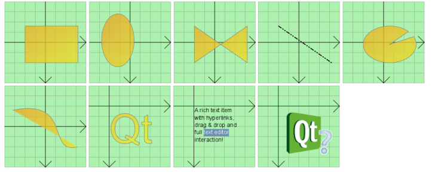

## 图形视图框架(Graphics View Framework)


Graphics View提供了一个surface,用于管理大量定制的2D图形项并与之交互,还提供了一个View小部件,用于可视化项目,并支持缩放和旋转.

该框架包含一个事件传播框架,该架构允许对场景中的项目提供精确的双精度交互功能.项目可以处理按键事件,鼠标按下,移动,释放和双击事件,还可以跟踪鼠标移动。

Graphics View使用BSP(二进制空间划分)树来提供非常快速的项目发现,因此,它可以实时地可视化大型场景,甚至是数百万个项目.

注意: 该图形视图在Qt4.2引入,取代了它的前身QCanvas

#### 图形视图架构(The Graphics View Architecture)

Graphics View为模型视图编程提供了一种基于项目的方法,很像InterView的便利类QTableView,QTreeView和QListView. 多个视图可以观察一个场景,该场景包含各种几何形状的项目.

#### 场景(The Scene)

QGraphicsScene 提供图形视图场景.现场职责如下:

* 为管理大量项目提供快速接口

* 将事件传播到每个项目

* 管理项目状态,例如选择和焦点处理

* 提供无变换的渲染功能，如打印

场景作为一个容器 QGraphicsItem 对象. 项通过调用添加到场景 QGraphicsScene::addItem(), 然后通过调用多个项目发现函数中的一个来检索. QGraphicsScene::items() 它的重载返回包含在一个点，一个矩形，一个多边形或一个一般向量路径上或与之相交的所有项. QGraphicsScene::itemAt() 返回特定点上的最上面的项.所有项目发现函数都以降序堆叠的顺序返回项目.第一个返回的项是最上面的,最后一个返回项是最下面的.

```
  QGraphicsScene scene;
  QGraphicsRectItem *rect = scene.addRect(QRectF(0, 0, 100, 100));

  QGraphicsItem *item = scene.itemAt(50, 50);
  // item == rect
```

QGraphicsScene's 事件传播体系结构为交付到项目安排场景事件,并管理项目之间的传播.如果场景在某个位置接收到鼠标按下事件,则场景将该事件传递到该位置的任何项.

QGraphicsScene还管理某些项目状态,比如项目选择和焦点.通过调用 QGraphicsScene::setSelectionArea()，传递任意形状,可以在场景中选择项目.这个功能也被用作QGraphicsView中橡皮筋选择的基础.调用QGraphicsScene::selectedItems()来获取当前选中的所有项目的列表. QGraphicsScene处理的另外一种状态是一个项是否具有键盘输入焦点.你可以通过调用QGraphicsScene::setFocusItem() 或者QGraphicsItem::setFocus()来设置一个焦点,或者通过调用QGraphicsScene::focusItem()来获取当前的焦点项目.

最后, QGraphicsScene允许您通过QGraphicsScene::render() 函数将场景的一部分渲染到绘图设备中.您可以在文本后面的打印部分了解更多信息.

#### 视图(view)

QGraphicsView 提供view小部件,用于可视化场景的内容.您可以将多个视图附加到同一个场景,从而在同一个数据集中提供多个视图.view小部件是一个滚动区域,提供滚动条用于大场景中导航.要启用OpenGL支持,可以通过调用QGraphicsView::setViewport()将QGLWidget设置为viewport.

```
QGraphicsScene scene;
myPopulateScene(&scene);

QGraphicsView view(&scene);
view.show();
```

视图接收来自键盘和鼠标的输入事件,并在将事件发送到可视化场景之前将这些事件转换为场景事件(在适当的地方将使用的坐标转换为场景坐标).

使用它的变换矩阵QGraphicsView::transform(),视图可以变换场景的坐标系统。这允许高级导航功能,如缩放和旋转。为了方便,QGraphicsView还提供了视图和场景坐标转换的函数:

* QGraphicsView::mapToScene()

* QGraphicsView::mapFromScene()

#### 图元(Item)

QGraphicsItem是场景中图形项目的基类. 图形视图为典型的形状提供了几个标准项,例如矩形(QGraphicsRectItem)， ellipses(QGraphicsEllipseItem), 和文本项(QGraphicsTextItem)，但是在编写自定义项时可以使用最强大的QGraphicsItem特性.此外，QGraphicsItem支持以下功能:

* 鼠标按下,移动,释放和双击事件,以及鼠标悬停事件,滚轮事件和上下文菜单事件.

* 键盘输入焦点和按钮事件

* 拖放功能

* 通过父子关系和使用QGraphicsItemGroup进行分组

* 碰撞检测

项目位于本地坐标系统中,与QGraphicsview一样,它还提供了许多函数,用于在项目和场景之间以及项目与项目之间映射坐标.同样,像QGraphicsView一样,它可以使用一个矩阵来转换它的坐标系统:QGraphicsItem::transform().这对于旋转和缩放单个项目非常有用.

项目可以包含其他项目(子项目). 父项的转换由它的所有子项继承.然而,不管一个项目的累积转换是什么,它的所有函数(QGraphicsItem::contains(),QGraphicsItem::boundingRect(),QGraphicsItem::collidesWith())仍然在本地坐标中运行.

QGraphicsItem通过QGraphicsItem::shape()函数和QGraphicsItem::collidesWith()支持碰撞检测这两个函数都是虚函数.通过从QGraphicsItem::shape()返回你的物品的形状作为一个本地坐标QPainterPath, QGraphicsItem将为你处理所有的碰撞检测.但是,如果您希望提供自己的碰撞检测,则可以重新实现QGraphicsItem::collidesWith()



#### 图形视图框架中的类(Classes in the Graphics View Framework)

这些类为创建交互式应用程序提供了一个框架.

| 类名 | 功能 |
|--|---|
| QGraphicsEffect | 用于所有图形效果的基类 |
| QGraphicsAnchor | 表示QGraphicsAnchorLayout中两个项之间的锚 |
| QGraphicsAnchorLayout | 可以在图形视图中锚定小部件的布局 |
| QGraphicsGridLayout | 在图形视图中管理小部件的网络布局 |
| QAbstractGraphicsShapeItem | 所有路径项的公共基础 |
| QGraphicsEllipseItem | 可以添加到QGraphicsScene中的椭圆项中 |
| QGraphicsItem | QGraphicsScene中所有图形项的基类 |
| QGraphicsItemGroup | 将一组项视为单个项的容器 |
| QGraphicsLineItem | 可以添加到QGraphicsScene中的行项目 |
| QGraphicsObject | 需要信号,槽和属性的所有图形项的基类 |
| QGraphicsPathItem | 路劲项,您可以添加到QGraphicsScene |
| QGraphicsPixmapItem | 你可以添加到QGraphicsScene的Pixmap项目 |
| QGraphicsPolygonItem | 多边形项目,你可以添加到QGraphicsScene |
| QGraphicsRectItem | 添加矩形项目到QGraphicsScene |
| QGraphicsSimpleTextItem | 简单的文本路径项,您可以添加到QGraphicsScene |
| QGraphicsTextItem | 显示格式化文本的文本项,添加到QGraphicsScene |
| QGraphicsLayout | 图形视图中所有布局的基类 |
| QGraphicsLayoutItem | 是否可以继承,以允许您的自定义项被布局管理 |
| QGraphicsLinearLayout | 在图形视图中管理小部件的水平或垂直布局 |
| QGraphicsProxyWidget | 代理层,用于在QGraphicsScene中嵌入QWidget |
| QGraphicsScene | 用于管理大量2D图形项目的Surface |
| QGraphicsSceneContextMenuEvent | 图形视图框架中的上下文菜单事件 |
| QGraphicsSceneDragDropEvent | 在图形视图框架中用于拖放的事件 |
| QGraphicsSceneEvent | 所有图形视图相关事件的基类 |
| QGraphicsSceneHelpEvent | 请求工具提示时的事件 |
| QGraphicsSceneHoverEvent | 在图形视图框架中悬浮事件 |
| QGraphicsSceneMouseEvent | 图形视图框架中的鼠标事件 |
| QGraphicsSceneMoveEvent | 图形视图框架中的鼠标移动事件 |
| QGraphicsSceneResizeEvent | 事件，用于在图形视图框架中调整小部件大小 |
| QGraphicsSceneWheelEvent | 图形视图框架中的滚动事件 |
| QGraphicsSimpleTextItem | 简单的文本路径项，您可以添加到QGraphicsScene |
| QGraphicsSvgItem | 可用于呈现SVG文件内容的QGraphicsItem |
| QGraphicsTextItem | 可以添加到QGraphicsScene以显示格式化文本的文本项 |
| QGraphicsTransform | 用于在QGraphicsItems上构建高级转换的抽象基类 |
| QGraphicsView | 小部件，用于显示QGraphicsScene的内容 |
| QGraphicsWidget | QGraphicsScene中所有部件项的基类 |
| QStyleOptionGraphicsItem | 用于描述绘制QGraphicsItem所需的参数 |


#### 图形视图坐标系统(The Graphics View Coordinate System)

图形视图基于笛卡尔坐标系;项目在场景中的位置和几何图形由两组数字表示: x坐标和y坐标. 当使用未转换视图观察一个场景时，场景上的一个单元用屏幕上的像素表示.

注意:不支持倒y轴坐标系统(y向上增长)，因为图形视图使用Qt的坐标系统。

在图形视图中有三种有效的坐标系统:项目坐标、场景坐标和视图坐标。为了简化实现，Graphics View提供了方便的函数，允许您在三个坐标系统之间进行映射。

在渲染时，图形视图的场景坐标对应于QPainter的逻辑坐标，视图坐标与设备坐标相同。在坐标系统文档中，您可以了解逻辑坐标和设备坐标之间的关系。


#### 项目坐标(Item Coordinates)

项目存在于它们自己的局部坐标系中。它们的坐标通常以其中心点(0,0)为中心，这也是所有变换的中心。项目坐标系统中的几何原语通常被称为Item点、Item行或Item矩形。

在创建自定义项目时，项目坐标是您所需要担心的全部;QGraphicsScene和QGraphicsView将为您执行所有转换。这使得实现定制项非常容易。例如，如果接收到鼠标按下或拖动输入事件，则事件位置以项目坐标表示。contains()虚函数接受项坐标中的point参数，如果某个点在项中，则返回true，否则返回false。类似地，项目的边框矩形和形状在项目坐标中。

在项目的位置是项目在其父坐标系中的中心点的坐标;有时也称为父坐标。这个场景在这个意义上被看作是所有无父母项目的“父母”。顶级项目的位置在场景坐标中。

子坐标是相对于父坐标的。如果子坐标未进行转换，则子坐标与父坐标之间的差异与父坐标中的项之间的距离相同。例如:如果一个未转换的子项目被精确地定位在它的父项目的中心点上，那么这两个项目的坐标系统将是相同的。但是，如果子节点的位置是(10,0)，则子节点的(0,10)点将对应于其父节点的(10,10)点。

因为项的位置和转换是相对于父元素的，所以子元素的坐标不受父元素转换的影响，尽管父元素的转换会隐式地转换子元素。在上面的例子中，即使父节点被旋转和缩放，子节点的(0,10)点仍然会与父节点的(10,10)点相对应。然而，相对于场景，孩子会跟随父母的转变和位置。如果父节点被缩放(2x, 2x)，子节点的位置将是场景坐标(20,0)，其(10,0)点将对应于场景上的点(40,0)。

对于QGraphicsItem::pos()是少数例外之一，QGraphicsItem的函数在项坐标中操作，而与项或其父项的转换无关。例如，一个项目的边界rect(即QGraphicsItem::boundingRect())总是在项目坐标中给出。


#### 场景坐标(Scene Coordinates)

场景代表了它所有项目的基础坐标系统。场景坐标系统描述了每个顶级项的位置，也构成了从视图交付到场景的所有场景事件的基础。场景中的每一项都有一个场景位置和边框(QGraphicsItem::scenePos()， QGraphicsItem::sceneBoundingRect())，以及它本地的项pos和边框。场景位置描述了物品在场景坐标中的位置，它的场景边界矩形是QGraphicsScene决定场景中哪些区域发生了变化的基础。场景中的更改通过QGraphicsScene::changed()信号进行通信，参数是一个场景矩形列表。

#### 视图坐标(View Coordinates)

视图坐标是小部件的坐标。视图坐标中的每个单元对应一个像素。这个坐标系统的特殊之处在于它相对于小部件或视口，不受所观察场景的影响。QGraphicsView的左上角总是(0,0)，右下角总是(视口宽度，视口高度)。所有鼠标事件和拖放事件最初都作为视图坐标接收，您需要将这些坐标映射到场景，以便与项目交互。

#### 坐标映射(Coordinate Mapping)

通常在处理场景中的项目时，将坐标和任意形状从场景映射到项目，从项目映射到项目，或者从视图映射到场景是很有用的。例如，当您在QGraphicsView的viewport中单击鼠标时，您可以通过调用QGraphicsView::mapToScene()，然后是QGraphicsScene::itemAt()来询问场景光标下是什么项目。如果你想知道一个项目在视图中的位置，你可以在项目上调用QGraphicsItem::mapToScene()，然后在视图上调用QGraphicsView::mapFromScene()。最后，如果您使用want来查找视图椭圆内的项目，您可以将QPainterPath传递给mapToScene()，然后将映射的路径传递给QGraphicsScene::items()。

通过调用QGraphicsItem::mapToScene()和QGraphicsItem::mapFromScene()，您可以将坐标和形状映射到或映射到一个项目的场景。还可以通过调用QGraphicsItem::mapToParent()和QGraphicsItem::mapFromParent()映射到项的父项，或者通过调用QGraphicsItem::mapToItem()和QGraphicsItem::mapFromItem()在项之间映射。所有的映射函数都可以映射点、矩形、多边形和路径。

视图中也有相同的映射功能，用于从场景映射到场景。QGraphicsView: mapFromScene()和QGraphicsView: mapToScene()。要从视图映射到项，首先要映射到场景，然后从场景映射到项。

#### 关键特性

缩放和旋转(Zooming and rotating)

QGraphicsView支持与QPainter通过QGraphicsView::setMatrix()实现的相同的仿射转换。通过对视图应用转换，您可以轻松添加对常见导航特性(如缩放和旋转)的支持。

下面是一个如何在QGraphicsView的子类中实现缩放和旋转槽的例子:

```
  class View : public QGraphicsView
  {
  Q_OBJECT
      ...
  public slots:
      void zoomIn() { scale(1.2, 1.2); }
      void zoomOut() { scale(1 / 1.2, 1 / 1.2); }
      void rotateLeft() { rotate(-10); }
      void rotateRight() { rotate(10); }
      ...
  };
```

槽可以连接到启用了自动重复功能的qtoolbutton上。
QGraphicsView在转换视图时保持视图的中心对齐。
请参阅弹性节点示例，了解如何实现基本的缩放特性。


#### Printing

图形视图通过其渲染函数QGraphicsScene::render()和QGraphicsView::render()提供单行打印。这些函数提供了相同的API:你可以通过传递一个QPainter给任何一个渲染函数来让场景或视图渲染它们的全部或部分内容到任何渲染设备中。这个示例展示了如何使用QPrinter将整个场景打印到整个页面中。

```
QGraphicsScene scene;
  scene.addRect(QRectF(0, 0, 100, 200), QPen(Qt::black), QBrush(Qt::green));

  QPrinter printer;
  if (QPrintDialog(&printer).exec() == QDialog::Accepted) {
      QPainter painter(&printer);
      painter.setRenderHint(QPainter::Antialiasing);
      scene.render(&painter);
  }
```

场景和视图渲染函数的区别是，一个在场景坐标中操作，另一个在视图坐标中操作。render()通常用于打印未转换的场景的整个片段，例如绘制几何数据，或打印文本文档。另一方面，QGraphicsView::render()适合截屏;它的默认行为是使用所提供的绘制器呈现视窗的确切内容。

```
  QGraphicsScene scene;
  scene.addRect(QRectF(0, 0, 100, 200), QPen(Qt::black), QBrush(Qt::green));

  QPixmap pixmap;
  QPainter painter(&pixmap);
  painter.setRenderHint(QPainter::Antialiasing);
  scene.render(&painter);
  painter.end();

  pixmap.save("scene.png");
```

当源区域和目标区域的大小不匹配时，源内容将被拉伸以适应目标区域。通过向正在使用的渲染函数传递Qt::AspectRatioMode，可以选择在内容被拉伸时保持或忽略场景的高宽比。

#### 拖放功能(Drag and Drop)

因为QGraphicsView间接继承QWidget，所以它已经提供了QWidget提供的相同拖放功能。另外，为了方便起见，图形视图框架为场景和每个项目提供了拖放支持。当视图接收到拖放时，它将拖放事件转换为QGraphicsSceneDragDropEvent，然后将其转发到场景。场景接管该事件的调度，并将其发送到鼠标光标下接受drop的第一项。

要从一个项目开始拖放，创建一个QDrag对象，传递一个指针到开始拖放的小部件。项目可以被多个视图同时观察，但是只有一个视图可以开始拖放。在大多数情况下，拖动是由于按下或移动鼠标而开始的，因此在mousePressEvent()或mouseMoveEvent()中，您可以从事件中获得原始小部件指针。例如:

```
  void CustomItem::mousePressEvent(QGraphicsSceneMouseEvent *event)
  {
      QMimeData *data = new QMimeData;
      data->setColor(Qt::green);

      QDrag *drag = new QDrag(event->widget());
      drag->setMimeData(data);
      drag->start();
  }
```

为了拦截场景的拖放事件，在QGraphicsItem子类中重新实现QGraphicsScene::dragEnterEvent()以及特定场景需要的任何事件处理程序。你可以在QGraphicsScene的每个事件处理程序的文档中了解更多关于图形视图中的拖放操作。

项目可以通过调用QGraphicsItem::setAcceptDrops()来启用拖放支持。要处理传入的拖放，重新实现QGraphicsItem::dragEnterEvent()、QGraphicsItem::dragMoveEvent()、QGraphicsItem::dragLeaveEvent()和QGraphicsItem::dropEvent()。

有关图形视图支持拖放操作的演示，请参阅拖放机器人示例。


#### 游标和工具提示(Cursors and Tooltips)


与QWidget一样，QGraphicsItem也支持游标(QGraphicsItem::setCursor())和工具提示(QGraphicsItem::setToolTip())。游标和工具提示在鼠标进入项目区域时由QGraphicsView激活(通过调用QGraphicsItem::contains()检测)。

您还可以通过调用QGraphicsView::setCursor()在视图上直接设置默认游标。

有关实现工具提示和光标形状处理的代码，请参见拖放机器人示例。


#### 动画(Animation)

图形视图支持动画在几个级别。您可以使用动画框架轻松地组装动画。为此，您需要您的项目从QGraphicsObject继承并将QPropertyAnimation与它们关联。QPropertyAnimation允许动画任何QObject属性。

另一个选项是创建一个从QObject和QGraphicsItem继承的自定义项。项目可以设置自己的计时器，并通过QObject::timerEvent()中的递增步骤控制动画。

第三个选项是通过调用QGraphicsScene::advance()来推进场景，而QGraphicsItem::advance()则是通过调用QGraphicsItem::advance()来推进场景。


#### OpenGL渲染

要启用OpenGL呈现，只需通过调用QGraphicsView::setViewport()将一个新的QGLWidget设置为QGraphicsView的viewport。如果你想要OpenGL抗锯齿，你需要OpenGL缓冲样本支持(参见QGLFormat::sampleBuffers())。

```
  QGraphicsView view(&scene);
  view.setViewport(new QGLWidget(QGLFormat(QGL::SampleBuffers)));
```


#### 项目组(Item Groups)

通过使一个项成为另一个项的子项，您可以实现项分组的最基本特性:项将一起移动，并且所有的转换将从父项传播到子项。

此外，QGraphicsItemGroup是一个特殊项，它将子事件处理与用于向组添加和从组中删除项的有用接口结合在一起。向QGraphicsItemGroup添加项将保持项的原始位置和转换，而重新生成项通常将导致子元素相对于其新父元素重新定位自身。为了方便起见，可以通过调用QGraphicsScene::createItemGroup()通过场景创建QGraphicsItemGroups。

#### 小部件和布局(Widgets and Layouts)

Qt 4.4通过QGraphicsWidget引入了对几何和布图感知项的支持。这个特殊的基本项类似于QWidget，但与QWidget不同的是，它不继承QPaintDevice;而不是QGraphicsItem。这允许您编写带有事件、信号和插槽、大小提示和策略的完整小部件，您还可以通过QGraphicsLinearLayout和QGraphicsGridLayout来管理小部件的几何图形。

###### QGraphicsWidget

基于QGraphicsItem的功能和精简的内存占用，QGraphicsWidget提供了两方面的优点:QWidget提供的额外功能，例如样式、字体、调色板、布局方向及其几何形状，以及QGraphicsItem提供的分辨率独立性和转换支持。因为图形视图使用实坐标而不是整数，所以QGraphicsWidget的几何函数也对QRectF和QPointF进行操作。这也适用于框架矩形，页边距和间距。例如，在QGraphicsWidget中，将内容边距指定为(0.5,0.5,0.5,0.5)并不少见。你可以创建子窗口和“顶级”窗口;在某些情况下，您现在可以将图形视图用于高级MDI应用程序。

支持QWidget的一些属性，包括窗口标志和属性，但不是全部。您应该参考QGraphicsWidget的类文档，了解什么是受支持的，什么是不受支持的。例如，您可以通过将Qt::Window窗口标志传递给QGraphicsWidget的构造函数来创建装饰窗口，但是图形视图目前不支持macOS上常见的Qt::Sheet和Qt::Drawer标志。

###### QGraphicsLayout

QGraphicsLayout是专门为QGraphicsWidget设计的第二代布局框架的一部分。它的API与QLayout非常相似。您可以在QGraphicsLinearLayout和QGraphicsGridLayout中管理小部件和子输出。您也可以通过自己子类化QGraphicsLayout来轻松编写自己的布局，或者通过编写适配器QGraphicsLayoutItem的子类来将自己的QGraphicsItem项添加到布局中。

###### 嵌入式小部件支持(Embedded Widget Support)

图形视图为在场景中嵌入任何小部件提供了无缝支持。您可以嵌入简单的小部件，如QLineEdit或QPushButton，复杂的小部件，如QTabWidget，甚至完整的主窗口。要将小部件嵌入到场景中，只需调用QGraphicsScene::addWidget()，或者创建一个QGraphicsProxyWidget实例来手动嵌入小部件。

通过QGraphicsProxyWidget, Graphics View能够深入集成客户端widget特性，包括游标、工具提示、鼠标、平板和键盘事件、子widget、动画、弹出窗口(例如QComboBox或QCompleter)，以及widget的输入焦点和激活。QGraphicsProxyWidget甚至集成了嵌入部件的选项卡顺序，这样您就可以通过选项卡进出嵌入的部件。您甚至可以在场景中嵌入一个新的QGraphicsView来提供复杂的嵌套场景。

#### 性能(Performance)

浮点比较指令(Floating Point Instructions)

为了准确、快速地将转换和效果应用到项目上，图形视图是在假设用户的硬件能够为浮点指令提供合理性能的情况下构建的。

许多工作站和台式计算机都配备了合适的硬件来加速这种计算，但一些嵌入式设备可能只提供库来处理数学操作或在软件中模拟浮点指令。

因此，某些类型的效果在某些设备上可能比预期的要慢。可以通过在其他领域进行优化来弥补这种性能损失;例如，使用OpenGL渲染一个场景。但是，如果这些优化也依赖于浮点硬件，那么它们本身可能会导致性能下降。

